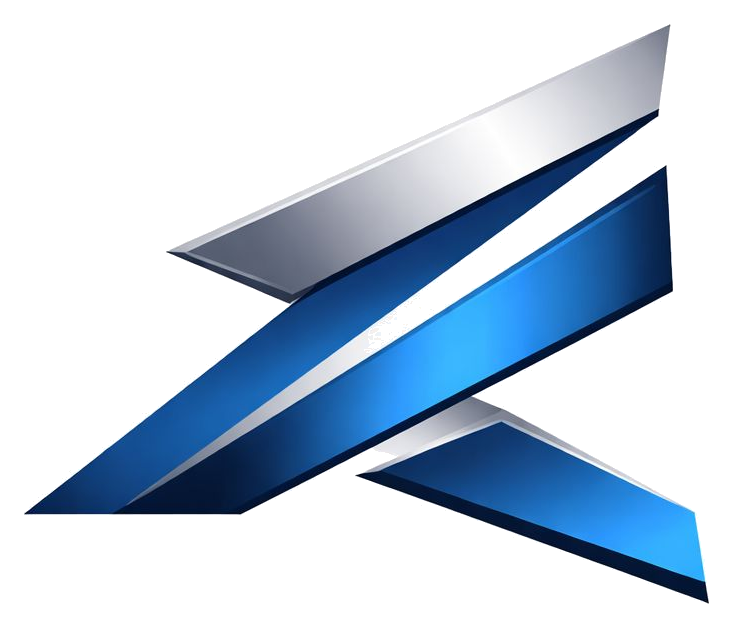
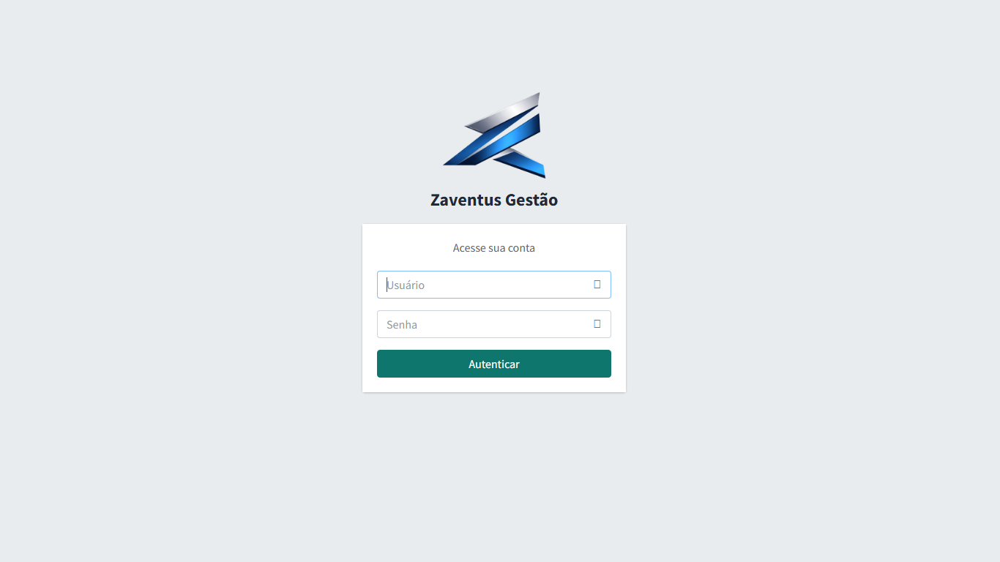
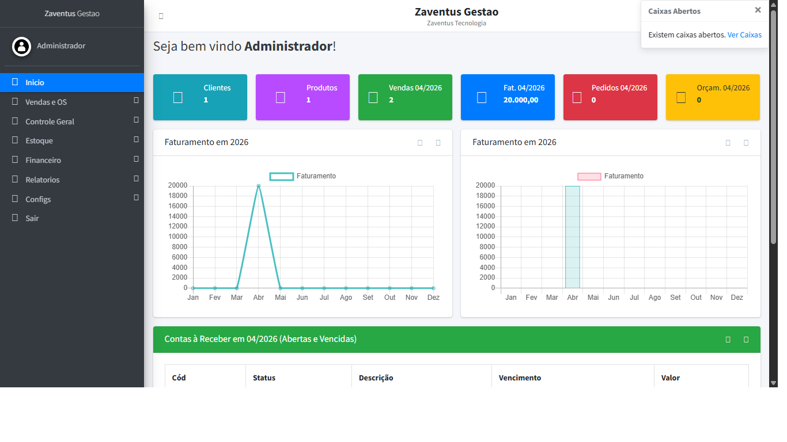
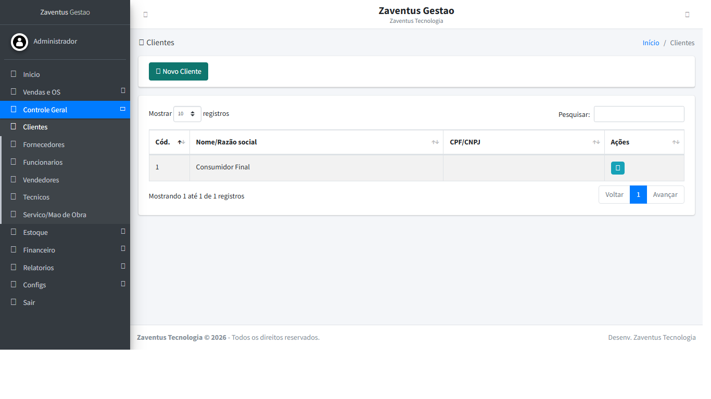
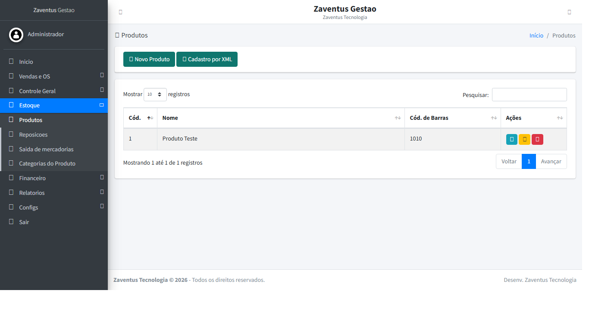
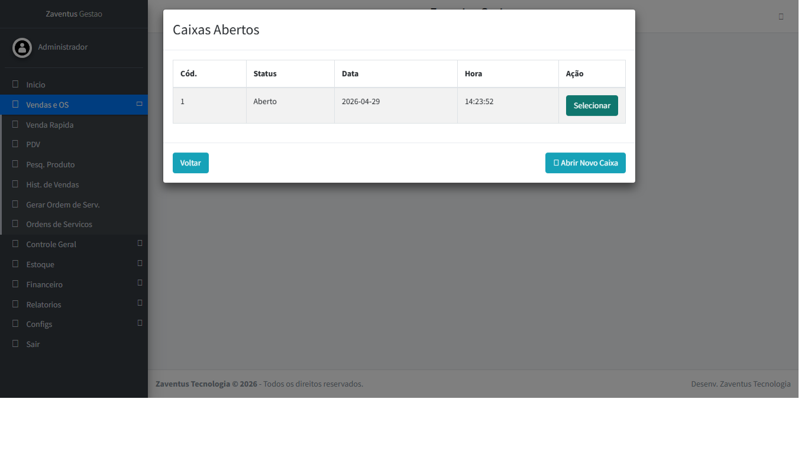
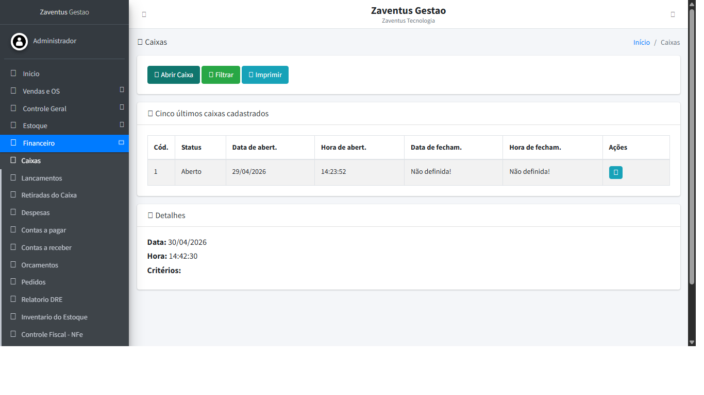
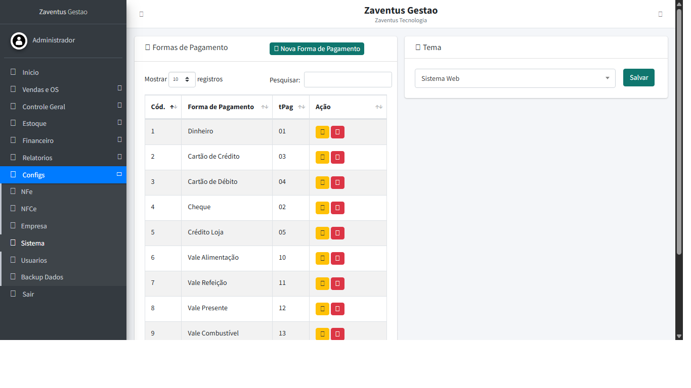

# Zaventus Gestão

**Zaventus Gestão** é um sistema ERP web para centralizar rotinas comerciais, operacionais e financeiras em uma única plataforma. A solução foi pensada para pequenos e médios negócios que precisam controlar vendas, PDV, estoque, clientes, fornecedores, caixa, relatórios e configurações fiscais sem depender de planilhas separadas.

> Este é um repositório público de apresentação. Ele não contém código fonte, credenciais, banco de dados, backups, certificados digitais, XML fiscal, chaves de acesso ou qualquer informação sensível do sistema.

## Visão Geral

O sistema organiza a operação em módulos integrados:

- **Vendas e PDV:** atendimento rápido, histórico de vendas, emissão e acompanhamento operacional.
- **Controle geral:** cadastro e consulta de clientes, fornecedores, funcionários e vendedores.
- **Estoque:** cadastro de produtos, categorias, reposições, saídas e acompanhamento de disponibilidade.
- **Financeiro:** caixas, lançamentos, retiradas, contas a pagar, contas a receber, orçamentos e pedidos.
- **Relatórios:** indicadores de vendas, financeiro, estoque e cadastros administrativos.
- **Configurações:** empresa, preferências do sistema, usuários, permissões e parâmetros fiscais.

## Prints do Sistema

### Login

A tela de login apresenta uma entrada limpa para acesso ao ambiente administrativo do Zaventus Gestão. O objetivo é manter a identidade visual da marca em destaque sem criar distrações para o usuário que acessa o sistema diariamente.

### Painel Inicial

O painel inicial reúne os principais indicadores da operação, como clientes cadastrados, produtos, vendas do período, faturamento, pedidos e orçamentos. Os gráficos ajudam a acompanhar a evolução do faturamento e facilitam uma leitura rápida da situação do negócio.

### Clientes

O módulo de clientes centraliza informações de cadastro e consulta, apoiando vendas, pagamentos e histórico comercial. A tela foi projetada para facilitar busca, visualização e manutenção dos registros.

### Produtos e Estoque

O módulo de produtos permite acompanhar itens comercializados, imagens, valores, categorias e informações usadas em vendas e reposições. Ele serve como base para o controle de estoque e para as operações do PDV.

### PDV

O PDV oferece uma experiência objetiva para operação de caixa. A proposta é acelerar o atendimento, reduzir etapas durante a venda e manter o operador focado nos produtos, totais e fechamento.

### Financeiro e Caixas

O módulo financeiro acompanha caixas, saldos, movimentações e filtros por período. Ele ajuda a organizar a rotina de abertura, fechamento e conferência, dando mais previsibilidade ao controle financeiro.

### Configurações

A área de configurações concentra preferências do sistema, formas de pagamento e ajustes administrativos. Esse módulo permite adaptar o Zaventus Gestão às necessidades da empresa e controlar parâmetros importantes para a operação.

## Segurança e Privacidade

Este repositório foi criado apenas para demonstração visual e comercial. Por segurança, foram excluídos:

- código fonte da aplicação;
- arquivos `.env` e configurações privadas;
- credenciais, senhas e tokens;
- dumps ou backups de banco de dados;
- certificados digitais;
- documentos fiscais, XMLs ou chaves de acesso;
- dados reais de clientes, fornecedores ou vendas.

## Observação

As telas exibidas usam ambiente de demonstração e podem mudar conforme evolução do produto. O objetivo deste material é apresentar a proposta, a organização e as funcionalidades principais do Zaventus Gestão.

